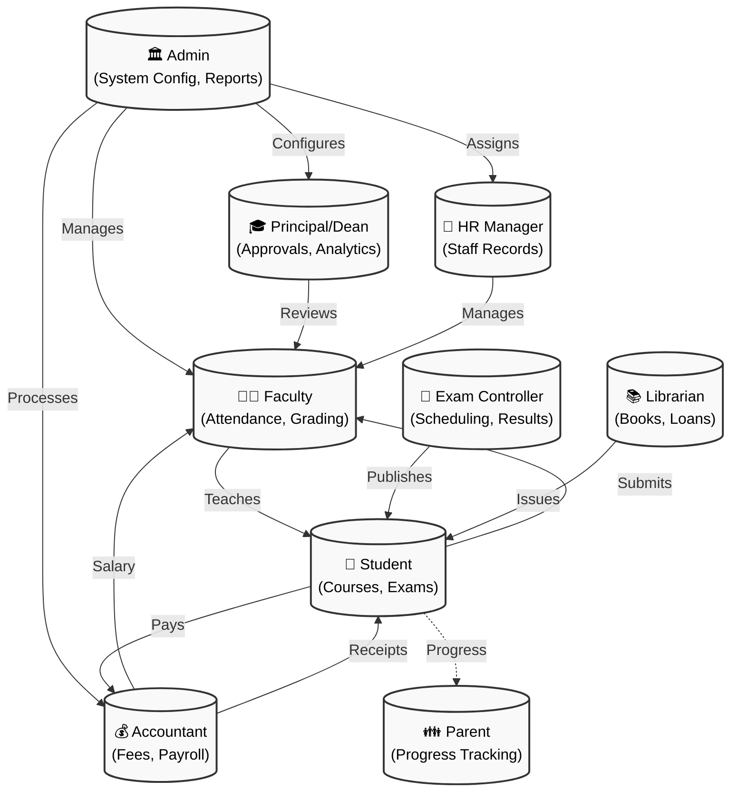

```mermaid
%% College Management System - Roles & Interactions
flowchart TD
    %% ===== ROLES =====
    Admin[("🏛️ Admin<br>(System Config, Reports)")]
    Principal[("🎓 Principal/Dean<br>(Approvals, Analytics)")]
    Faculty[("👩🏫 Faculty<br>(Attendance, Grading)")]
    Student[("🎒 Student<br>(Courses, Exams)")]
    Parent[("👪 Parent<br>(Progress Tracking)")]
    Accountant[("💰 Accountant<br>(Fees, Payroll)")]
    Librarian[("📚 Librarian<br>(Books, Loans)")]
    HR[("👔 HR Manager<br>(Staff Records)")]
    ExamController[("📝 Exam Controller<br>(Scheduling, Results)")]

    %% ===== WORKFLOWS =====
    %% Admin sets up system
    Admin -->|Configures| Principal
    Admin -->|Manages| Faculty
    Admin -->|Processes| Accountant
    Admin -->|Assigns| HR

    %% Academic Flow
    Principal -->|Reviews| Faculty
    Faculty -->|Teaches| Student
    Student -->|Submits| Faculty
    ExamController -->|Publishes| Student
    Student -->|Pays| Accountant

    %% Parent & Support
    Student -.->|Progress| Parent
    Librarian -->|Issues| Student

    %% HR & Finance
    HR -->|Manages| Faculty
    Accountant -->|Salary| Faculty
    Accountant -->|Receipts| Student

    %% Styling
    classDef role fill:#f9f9f9,stroke:#333,stroke-width:2px,color:#000;
    class Admin,Principal,Faculty,Student,Parent,Accountant,Librarian,HR,ExamController role;

```